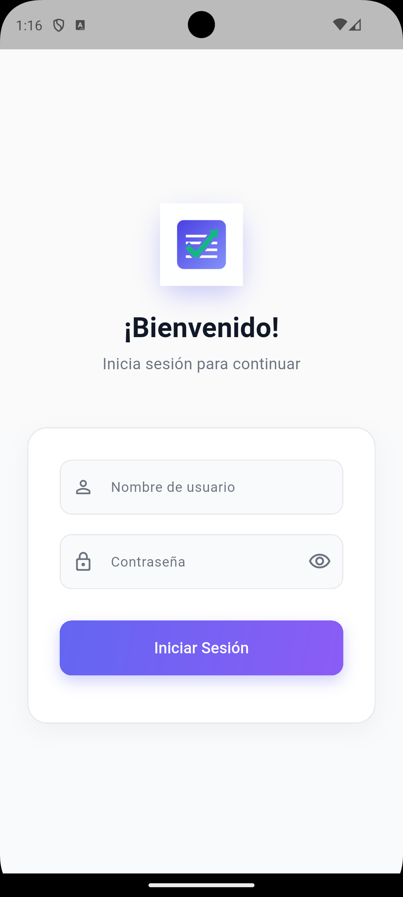
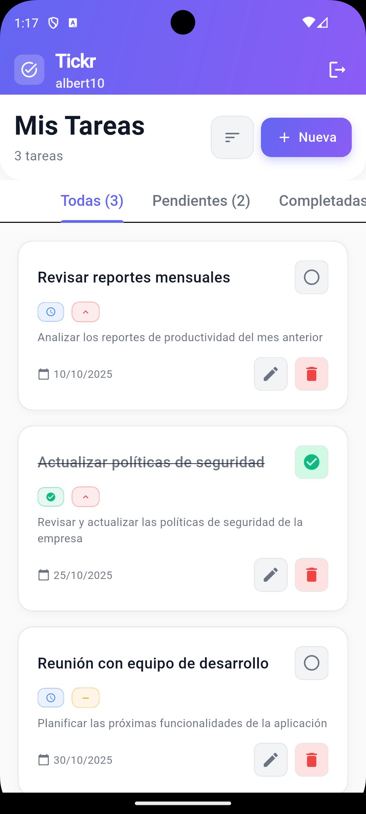
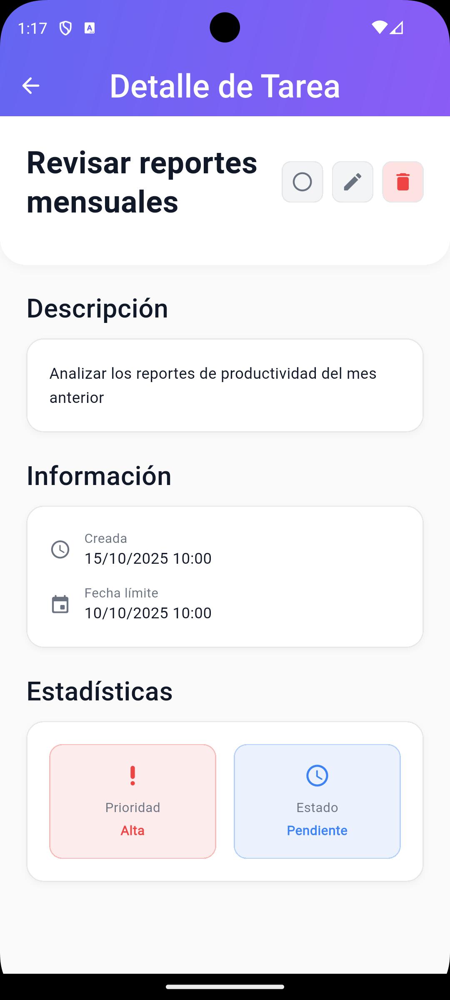
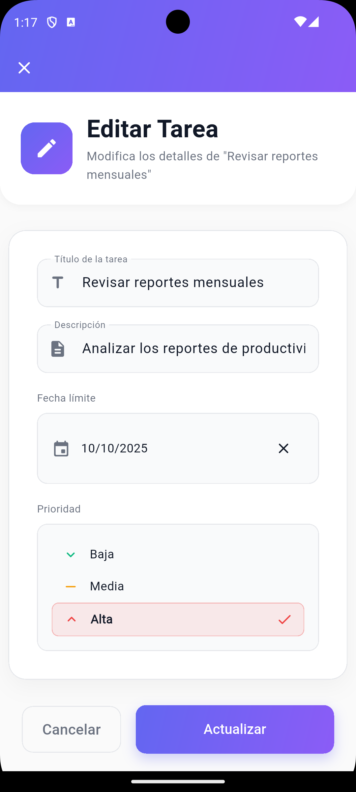

# Tickr

Aplicación Flutter para gestión de tareas con Clean Architecture.

[](https://github.com/wilrojasdev/tickr/releases/download/version1/app-release.apk)


---

## 📱 Capturas de pantalla

<p align="center">
  
  
  
   
</p>

---
## Instrucciones de ejecución

Requisitos previos:
- Flutter  (3.32.0)
- Dart SDK (incluido con Flutter)
- Xcode (iOS) / Android Studio (Android)

Instalación de dependencias:
```bash
flutter pub get
```

Ejecutar en emulador/dispositivo, asegurese de que esten conectados:
```bash

# Android
flutter run --release


```

Compilación release:
```bash
flutter build apk --release    

```

## Arquitectura

Se implementa Clean Architecture con separación estricta por capas y principios SOLID.

- Capa `domain`:
  - Entidades inmutables (`Task`, `User`, etc.).
  - Interfaces de repositorio (`TaskRepository`, `AuthRepository`).
  - Casos de uso como clases invocables (`GetTasks`, `CreateTask`, `Login`, etc.).

- Capa `data`:
  - Data sources (`TaskRemoteDataSource`, `AuthLocalDataSource`).
  - Modelos (DTOs) y mapeo `Model ↔ Entity`.
  - Implementaciones de repositorio (`TaskRepositoryImpl`, `AuthRepositoryImpl`).
  - Manejo de errores con `Exceptions` → `Failures` en casos de uso.

- Capa `presentation`:
  - `Providers` (con Provider) para orquestar casos de uso y estado (`TaskProvider`, `AuthProvider`).
  - Vistas (Widgets) solo con lógica de UI: navegación, diálogos, wiring.
  - Widgets reutilizables (p.ej., `TaskAppBar`, `AppLogo`).

- `core` (compartidos):
  - `error/` mapeadores y tipos (`ErrorMapper`, `exceptions.dart`, `failures.dart`).
  - `services/` (`NotificationService`).
  - `theme/` (`AppColors`, `AppTypography`, `AppTheme`).
  - `constants/` (`AppConstants`).
  - `utils/` (`DateFormatter`).


## Inyección de dependencias
Se utiliza `get_it` en `lib/injection.dart` para registrar data sources, repositorios, casos de uso y providers.

## Testing
- Tests de `TaskRemoteDataSource` con fakes de `AuthLocalDataSource` (éxito/error para get/create/update/delete).

## Usuarios de demo (FakeRepository)
- Usuario 1:
  - username: `albert10`
  - password: `albert123456`
  - tareas iniciales: 3
- Usuario 2:
  - username: `felipe10`
  - password: `feli123456`
  - tareas iniciales: 2

